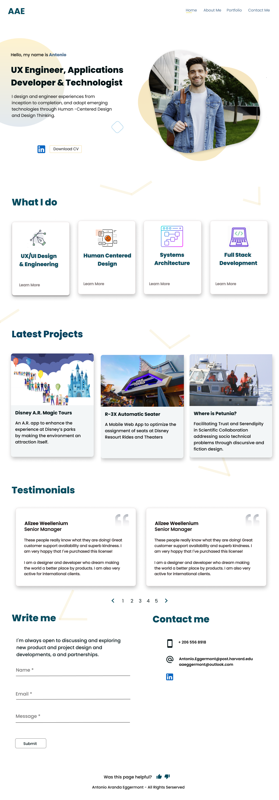

# Project Idea: An Interactiuve Professional Portfolio developed in ReactJS

## Elevator Pitch

* I am a software developer and a UX engineer. An important aspect of my career development as a technologist designer is to explore different project opportunities by showcasing my skills with different teams at my company and  beyond. So hiring managers, and other designer and engineers will be the users of this app. THe value the users will gain is to have a solid and clear understanding of my skill set, potential, and the projects I have developed and contrubuted.

* I elected to use a Firebase database to store the contents of the portfolio to be able to update the different pages and my own profile without having to do deploy the ReactJS app. In addition, I plan to host the ReactJS app in Firebase as well.  Features like function base components, project recommendations, and basic analytics to find out what features and pages are being viewed are part of my final project.

* Since the beginning of the course I have been developing this portfolio by using the skills and knowledge I have been gaining from the course lectures and the assignments. So a substantial amount of work in base UI has been done towards building this app.  However, all data content is currently card-coded, and the recommender project feature have not been implemented. So the final project will consist on enhancing the current MVP I have developed using Firebase for content management and hosting. 

# Project dependencies

* Firebase integration with props in React components across all pages.

* Firebase as a hosting platform for the React APP

* Potential  Javascript page recommendation libraries

* Further learning on React MUI framework for more complex interactions and visualizations

## Tasks to complete

### Week 1:

* Creating a Firestore data base and connect it with the Portfolio app

* Structuring the data in the firestore data base by page

* Extract the content data from the Firestore and propagated it into the different components via React props.

* Deploy the app in Firebase

### Week 2:

* Implement a simple recommendation engine using a Firestore  to suggest the viewer other similar pages they might be interested in viewing based on the current page being viewed. Log some viewing analytics into the firestore

### Week 3:

* Enhance further the look and feel using React MUI framework and standard CSS for  Portfolio sample projects with the features developed in weeks 1 and 2.

## High Fidelity Mockups

